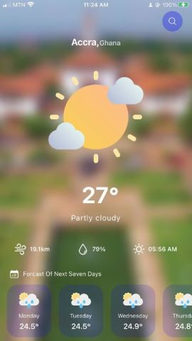

# GROUP-44-PRojEcT
All-Tech 

MEMBERS IDs
1. 10969079
2. 10960289
3. 10973308
4. 10949325
5. 10962452
6. 10966345
7. 10980032
8. 10974080
9. 10953450
10. 
# Weather App

## Get Started

install dev dependencies

### `npm install` or `yarn install`

## Then

Run The app

### `npm start` or `yarn start`

Runs your app in development mode.

Open it in the [Expo app](https://expo.io) on your phone to view it. It will reload if you save edits to your files, and you will see build errors and logs in the terminal.

#### `npm run ios` or `yarn run ios`
Like `npm start` / `yarn start`, but also attempts to open your app in the iOS Simulator if you're on a Mac and have it installed.

#### `npm run android` or `yarn run android`
Like `npm start` / `yarn start`, but also attempts to open your app on a connected Android device or emulator. Requires an installation of Android build tools.
 
